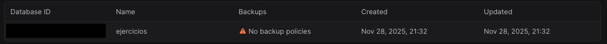
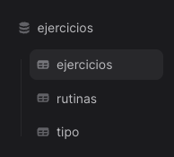
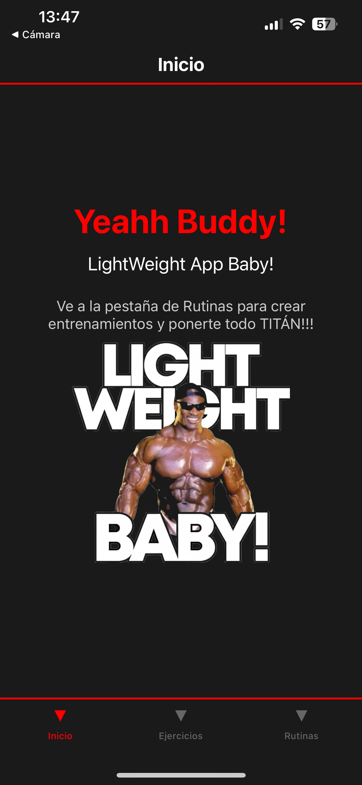
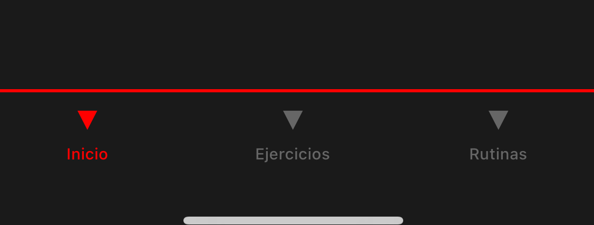
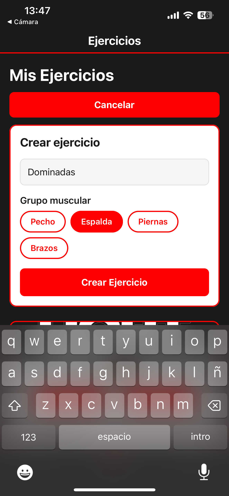
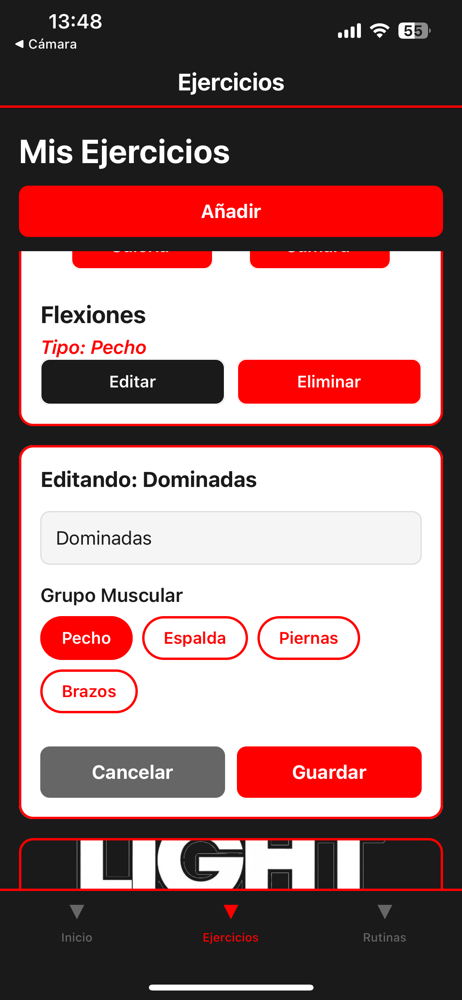
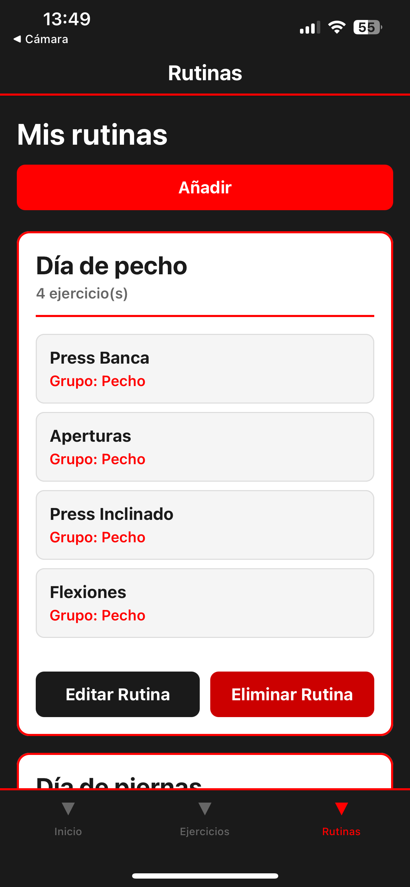
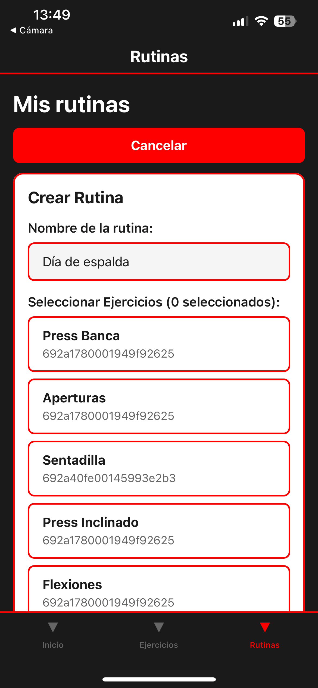
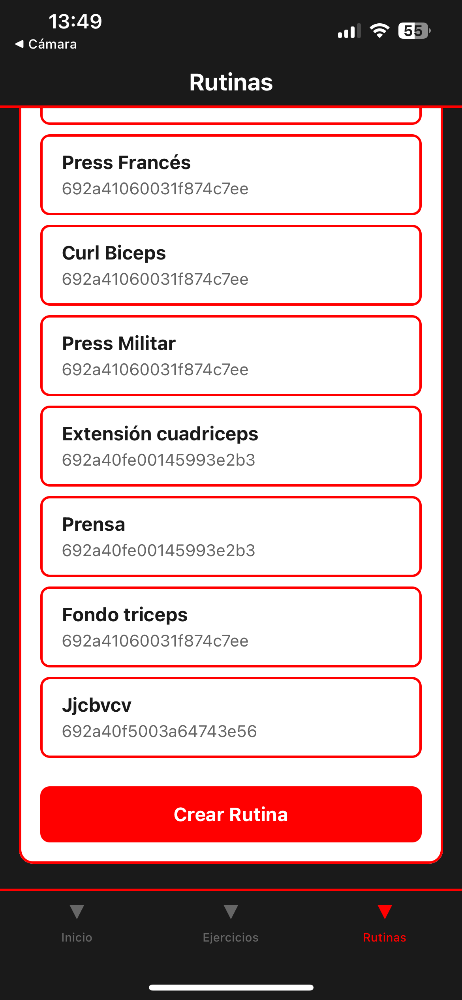
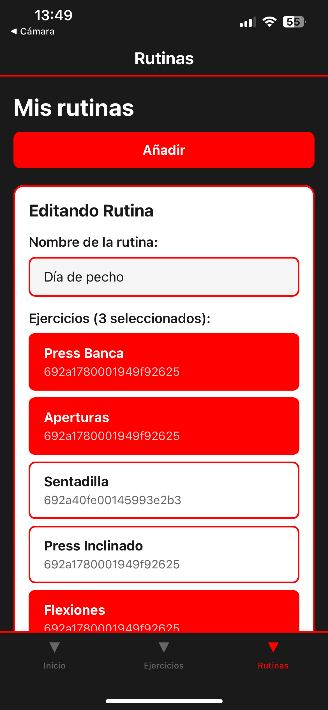

# LightWeight APP
Ahora el que no se pone fuerte es porque no quiere.


## Índice
- [Descripción de la app](#descripción-de-la-app)
- [API y base de datos](#api-y-base-de-datos)
- [Ficheros utilizados](#ficheros-utilizados)
   - [enviroments.ts](#enviromentsts)
   - [ejerciciosApi.tsx](#ejerciciosapitsx)
      - [GET](#get)
      - [POST](#post)
      - [PATCH](#patch)
      - [DELETE](#delete)
   - [rutinasApi.tsx](#rutinasapitsx)
   - [tiposApi.tsx](#tiposapitsx)
   - [Estructura de la APP](#estructura-de-la-app)
      - [Navegación](#navevación)
         - [index.tsx](#indextsx)
         - [home.tsx](#hometsx)
         - [_layout.tsx](#_layouttsx)
      - [Componentes principales](#componentes-principales)
         - [exercises.tsx](#exercisestsx)
            - [EcercisesCard.tsx](#exercisecardtsx)
            - [BotonImagenCategoria.tsx](#botonimagencategoriatsx)
         - [routines.tsx](#routinestsx)
- [Conclusiones finales](#conclusiones-finales)
- [Repositorio](#repositorio)

## Descripción de la app

El objetivo de esta aplicación es poder almacenar tantos ejercicios como el usuario desee, clasificandolos según el grupo muscular, para posteriormente poder definir rutinas de entrenamiento en función de los ejercicios creados.

## API y base de datos

Para generar la API y la base de datos se utilizará Appwrite. Se creará un proyecto por defecto 'Appwrite Project' en el que crearemos la base de datos ejercicios:



Una vez creada, dentro se podrán definir las tablas que se deseen. En el caso de la app se han creado las siguientes:

- ejercicios: columnas -> ejercicio y tipo (refiriendose al grupo muscular)
- rutinas: columnas -> tipo (grupo muscular), ejercicio y nombre (nombre de la rutina que definirá el usuario)
- tipo: columna -> grupo (grupos musculares)

* *Appwrite te genera automáticamente un ID tipo string para cada columna*




El endpoint por defecto de Appwrite es: https://cloud.appwrite.io/v1

Appwrite también nos proporciona los IDs necesarios que se definirán en *enviroments.ts*

## Ficheros utilizados
Los ficheros empleados para la construcción de la app son los siguientes:

- **enviroments**: aquí se definirán las variables de entorno para poder conectarnos con la API 
- **ejerciciosApi, rutinasApi, tiposApi**: en estos ficheros se desarrollarán los métodos necesarios para hacer las llamadas a la API y realizar un CRUD básico
- **index**: en este fichero simplemente se redirecciona al fichero home
- **home**: screen principal de la app
- **_layout**: la navegación de la app se llevará a cabo mediante pestañas en el la zona inferior de la app en lugar de emplear botones
- **ExerciseCard**: componente en el que irá cada ejercicio creado por el usuario
- **BotonImagenCategoria**: simplemente se definen los botones para interactuar con la galería y la cámara
- **exercies**: uno de los ficheros principales en los que se crearán las funciones con los que manejaremos el CRUD y se manejarán las vistas para ver, crear, editar o eliminar ejercicios
- **routines**: otro de los ficheros principales que servirán para el CRUD de las rutinas así como las vistas para ver, crear, editar y eliminar rutinas

Más adelante se desglosará cada uno de estos ficheros.

### enviroments.ts

Aquí se tratarán las variables de entorno para la conexión con la API. La estructura es la siguiente:

```javascript
export const CONFIG = {
    endpoint: "https://cloud.appwrite.io/v1",
    projectId: "el ID que te proporciona Appwrite",
    databaseId: "ID de la base de datos 'ejercicios'",
    collections:{
        ejercicios: "ejercicios", // tabla ejercicios
        rutinas: "rutinas", // tabla rutinas
        tipos: "tipo", // tabla tipos
    }
};
// Importante que los nombres de las tablas sean EXACTAMENTE iguales a los que están en Appwrite
```

### ejerciciosApi.tsx

En este fichero se definirá tanto la ruta de la API relacionada con la tabla *ejercicios* como las funciones con los métodos GET, POST, PATCH y DELETE.

> [!NOTE]
> Parece que a Appwritte no le gusta PUT, por ello se utiliza PATCH

En primer lugar han de importarse las variables de entorno CONFIG definidas anteriormente y definir la cosntante con la ruta de la API

```javascript
import { CONFIG } from "../enviroment";

const URL = `${CONFIG.endpoint}/databases/${CONFIG.databaseId}/collections/${CONFIG.collections.ejercicios}/documents`;
```

La explicación de la URL es la siguiente:

- Ruta del endpoint
- Le indicamos que vamos a la base de datos (database) y le definimos la id de la que nos interesa (CONFIG.databaseId)
- Le indicamos las tablas (collections) y el id de la tabla ejercicios en este caso (CONFIG.collections.ejercicios)
- Las filas (documents)

> [!NOTE]
> Los métodos son similares en todos los ficheros, tanto de ejercicios como de rutinas y tipos, por lo que solo se explicará en este apartado el fichero de ejerciciosApi.tsx

#### GET

Este método será el encargado de hacer la petición para obtener todos los ejercicios de la tabla *ejercicios*. Empleando un *fetch* se indicará la URL de la API y el método de la llamada. Como header, Appwrite nos obliga a especificarle el proyecto, por eso se usa:

```javascript
'X-Appwrite-Project': CONFIG.projectId,
```

A continuación se realiza un manejo de errores en caso de que la consulta no sea exitosa:

```javascript
if(!response.ok){
   throw new Error('Error al obtener ejercicios');
}
```

El manejo de errores va a ser común en el resto de métodos, por lo que solo se deja explicado en este apartado.

Luego se almacena la respuesta en un *json* que se llamará *data* para finalmente, con el uso de un *map* recorrer el *json* de respuesta y devolver cada ejercicio recibido en la llamada:

```javascript
const data = await response.json();

// Mapeo del data.documents que nos devuelve appwrite
return (data.documents || []).map((doc: any) => ({
   id: doc.$id,
   ejercicio: doc.ejercicio,
   tipo: doc.tipo,
}));
```

#### POST

Este método se ocupará de añadir nuevos elementos a su tabla correspondiente empleando *POST*. Es necesario especificar que ejercicio y a que tipo pertenece, por lo que se debe pasar a la función estos valores:

```javascript
export async function postEjercicios(ejercicio: string, tipo: string){
```

A continuación se especifica el método empleado así como la cabecera y los datos que se le mandarán a la API:

```javascript
method: 'POST', // método empleado
headers: {
   'Content-Type': 'application/json',
   'X-Appwrite-Project': CONFIG.projectId,
},
body: JSON.stringify({
   documentId: 'unique()', // IDs únicos
   data: {
         ejercicio: ejercicio,
         tipo: tipo,
   },
}),
```

Seguido a esto se emplea el manejo de errores explicado anteriormente. A continuación tenemos el cuerpo que se le envía a la api:

```javascript
const data = await response.json();
return {
   id: data.$id,
   ejercicio: data.ejercicio,
   tipo: data.tipo,
};
```

#### PATCH

Este método se encarga de la edición de los ejercicios. Para ello va a ser necesario especificar el id que va a editar así como los nuevos valores introducidos por el usuario:

```javascript
export async function putEjercicios(id: string, ejercicio: string, tipo: string){
```

Es importante recibir el id que se va a editar, por ello se le pasa como elemento de la función.

Cómo siempre, es necesario especificar tanto el método empleado como la cabecera y datos introducidos por el usuari:

```javascript
method: 'PATCH', // cosas de appwrite que no usa PUT
headers: {
   'Content-Type': 'application/json',
   'X-Appwrite-Project': CONFIG.projectId,
},
body: JSON.stringify({
   data: {
         ejercicio: ejercicio,
         tipo: tipo
   },
}),
```

> [!NOTE]
> Cabe señalar que en el desarrollo de esta práctica se tuvo problemas con el método PUT, que suele ser el más empleado... cosas de Appwrite. En este caso el método que dió resultado fue PATCH

En este caso solo se devuelven el ejercicio y el tipo, ya que el ID queda guardado al seleccionar el ejercicio y no es necesario (tampoco es la idea) modificarlo.

Después del manejo de errores queda la devolución a la API:

```javascript
return await response.json();
```

#### DELETE

Por último queda la posibilidad de eliminar elementos. Para ello simplemente es necesario indicarle a la API el id a eliminar:

```javascript
export async function deleteEjercicio(id: string){
```

Nuevamente, especificar el método y cabeceras obligatorias:

```javascript
method: 'DELETE',
headers: {
   'Content-Type': 'application/json',
   'X-Appwrite-Project': CONFIG.projectId,
},
```

Y tras el manejo de errores, como no hay que enviarle ningún tipo de info a la API mas que el id que se desea eliminar, simplemente cerramos con un *return* y ya se tendrían los 4 métodos necesarios para un CRUD convencional.

### rutinasApi.tsx

En esta sección, los métodos empleados son similares a los explicados anteriormente. Como única particularidad cabe señalar el cambio en la URL de la API que se emplea, ya que se va a manejar una tabla diferente:

```javascript
const URL = `${CONFIG.endpoint}/databases/${CONFIG.databaseId}/collections/${CONFIG.collections.rutinas}/documents`;
```

Importante el cambio de ejercicios a rutinas.

### tiposApi.tsx

Al igual que el apartado anterior... no olvidar cambiar la tabla que se va a manipular:

```javascript
const URL = `${CONFIG.endpoint}/databases/${CONFIG.databaseId}/collections/${CONFIG.collections.tipos}/documents`;
```

> [!NOTE]
> La única particularidad a tener en cuenta en este fichero es que solo necesitamos obtener los tipos musculares, ya que la idea es que no sean manipulables por el usuario y solo puedan ser gestionados por el propietario de la APP. Por eso solo se emplea el método GET de forma similar a la explicada anteriormente.


## Estructura de la APP

En este apartado se explicarán los principales componentes que conforman la vista y uso de la app. Desde la pantalla de inicio, la navegación entre las sceens de la APP, los métodos principales que permiten el correcto uso, etc...

### Navevación

Para la gestión de la navegación se opta por un manejo de pestañas a través de un menú inferior que permite cambiar entre las diferentes vistas de la app:

- Inicio
- Ejercicios
- Rutinas

#### index.tsx

Como en todo proyecto, siempre existe un fichero por defecto que React-Native se encarga de renderizar. En el diseño de esta APP, se deja un poco de lado, ya que directamente redireccionamos al componente *home.tsx* y a partir de ahí empieza la magia:

```javascript
import { Redirect } from 'expo-router';

export default function Index(){
  return <Redirect href="/(tabs)/home" />; 
}
```

Se observa que simplemente, con el uso de *Redirect*, enviamos al usuario (sin que él se entere de nada) a la vista *home.tsx*

#### home.tsx

Nos encontramos en la primera vista que se encontrará el usuario al abrir la APP. Como elementos señalables se tiene:

- Cabecera indicando en que vista se encuentra el usuario y un menú inferior que permite navegar entre las tres vistas principales de la APP (explicado más adelante en [_layout.tsx](#_layouttsx))
- Cuerpo principal de la APP (elementos que se tratarán en este apartado)

En este componente se encuentra básicamente una introducción a la app. Solo se emplean una serie de mensajes e imagen para dar la bienvenida.

```javascript
<Text style={styles.title}>Yeahh Buddy!</Text>
<Text style={styles.subtitle}>LightWeight App Baby!</Text>
<Text style={styles.info}>Ve a la pestaña de Rutinas para crear entrenamientos y ponerte todo TITÁN!!!</Text>
<Image source={require('../../assets/images/light-weight.jpg')} style={styles.imagen} resizeMode='contain' />
```

Sencillo. Solo se tienen:

- Un saludo inicial
- Una invitación a una vida un poco más saludable
- Un señor muy fuerte

*Y un poco de humor =)*



#### _layout.tsx

Este componente es el encargado de la navegación entre las vistas. Al introducirlo en la carpeta de *(tabs)*, le indica a react-native de que esta va a ser la carpeta donde vamos a manejar las diferentes screens de la aplicación. Así que no es necesario llamarlo desde ningún componente como si haríamos en el caso de usar una navegación por botones.

*'expo-router* nos va a permitir esta navegación:

```javascript
import { Tabs } from 'expo-router';
```

Dentro de la etiqueta *'Tabs'* especificamos el estilo que va a tener este menú y se indicarán las diferentes *tabs* empleadas:

```javascript
<Tabs
//definimos estilos varios en screenOptions
>
   <Tabs.Screen
      name="home"
      options={{
         title: 'Inicio',
      }}
   />
   <Tabs.Screen
      name="exercises"
      options={{
         title: 'Ejercicios',
      }}
   />
   <Tabs.Screen
      name="routines"
      options={{
         title: 'Rutinas'
      }}
   />
</Tabs>
```

Como se puede observar, en los atributos dentro de *Tabs.Screen* se indican:

- **name**: nombre exacto del fichero al que redirecciona
- **options -> title**: nombre que aparecerá en la vista 

Con esto, el usuario tendría disponible la navegación por toda la aplicación. 



### Componentes principales

El plato fuerte de la aplicación viene en esta sección. Aquí se explicarán los componentes que permitirán a usuario hacer el CRUD que necesita para crear ejercicios y las rutinas.

#### exercises.tsx

En esta vista se mostrará la lista de ejercicios, así como la posibilidad de crear, editar y eliminar. El apartado visual es el siguiente:


Se tiene el títilo de la sección, un botón para añadir ejercicios y el [componente](#exercisecardtsx) de cada ejercicio.

Cada ejercicio está envuelto en un componente [ExerciseCard.tsx](#exercisecardtsx) que se explicará más adelante. 

Como introducción a la vista, y lo principal que necesita el usuario, es mostrar todos los ejercicios, por ello se emplea un *useEffect* que carga el principal método *cargarEjercicios*, desde que se hará el **GET** para obtener el listado de ejercicios.

```javascript
useEffect(() => {
   cargarEjercicios();
}, []);

// obtener los ejercicios de la API
const cargarEjercicios = async () => {
   try{
      setLoading(true); // indicador de carga en lo que se obtienen los ejercicios

      const [ejerciciosData, tiposData] = await Promise.all([ // con promise realizamos todas las consultas a la vez, en vez de una por una (más rápido)
            getEjercicios(), // método get indicado en ejerciciosAPI
            getTipos() // método get para obtener los tipos
      ]);
      setEjercicios(ejerciciosData);
      setTipos(tiposData);
   } catch (error) {
      console.error("Error al cargar ejercicios: ", error);
      Alert.alert("Error", "Error al cargar ejercicios");
   } finally {
      setLoading(false);
   }
};
```

Realmente, no se trata de una función como tal, sino de una constante que contiene una función *flecha* propia de javascript y desde la que se hace el get necesario dentro de un *try/catch* para el manejo de errores. Mediante *Promise* se lanza la consulta de forma paralela, en lugar de una en una. Con ello se obtiene mayor eficiencia en la llamada a la API.

Mas adelante, en la propia vista, se mostrará una lista con el renderizado de los ejercicios de la siguiente manera:

```javascript
const renderEjercicio = ({item}: {item:any}) => {
// resto del codigo..

   return(
      <ExerciseCard // componente que se explicará más adelante
            ejercicio={ejercicioConGrupo} // ejercicio espera tanto el nombre del ejercicio como el grupo muscular
            selectedImage={imagenesEjercicios[item.id]}
            onPickImage={() => pickImageAsync(item.id)}
            onTakePhoto={() => takePictureAsync(item.id)}
            onEditar={() => handleIniciarEdicion(item.id, item.ejercicio, item.tipo)}
            onEliminar={() => handleEliminarEjercicio(item.id, item.ejercicio)}
      />
   );
};

// resto de la vista...

{ejercicios.length === 0 ? ( // en caso de que no exista ejercicios ...
      <View style={styles.emptyContainer}>
         <Text style={styles.emptyText}>No hay ejercicios disponibles</Text>
         <Text style={styles.emptySubtext}>Crea tu primer ejercicio ;)</Text>
      </View>
) : ( // ... pero si hay ejercicios:
      <FlatList
         data={ejercicios}
         renderItem={renderEjercicio}
         keyExtractor={(item) => item.id}
         contentContainerStyle={styles.listContent}
         showsVerticalScrollIndicator={false}
      />
)}
```

Con *renderEjercicios* entramos en un bucle *map* para recorrer cada ejercicio de la bbdd y *'crear'* cada *EjerciseCard* con sus props que se explicarán en su sección. Finalmente, casi al terminar la vista, tenemos la condición de que si NO existen ejercicios se invita al usuario a la creación del primero. Si ya existen, con *FlatList* devolvermos lo que se ha obtenido de *renderEjercicios*. De esta manera ya el usuario tendría la vista completa de los ejercicios existentes.

Continuando por el componente entramos en la siguiente constante para crear ejercicios: *handleCrearEjercicio*. De manera similar, se tiene una función flecha para la creación de un ejercicio. En primer lugar se obliga al usuarioa introducir todos los datos, tanto el nombre del ejercicio como el tipo al que pertenece:

```javascript
if(!nombreNuevo.trim()) {
   Alert.alert("Validación", "El nombre del ejercicio es obligatorio");
   return;
}
if(!tipoSeleccionado){
   Alert.alert("Validación", "Debes seleccionar un grupo muscular");
   return;
}
```

Nuevamente, dentro de un *try/catch* para el manejo de fallos, activamos el formulario de creación *setCreando(true)* (que se define como *false* en el hook inicial). Desde ahí, se llama al método POST, pasándole los campos necesarios: nombre y tipo (se usa trim en nombre para limpiar espacios). A continuación se resetea el formulario y llamamos de nuevo a *cargarEjercicios* para refrescar la vista:

```javascript
setCreando(true);
await postEjercicios(nombreNuevo.trim(), tipoSeleccionado);

// resetear formulario
setNombreNuevo('');
setTipoSeleccionado('');
setFormulario(false);

// refrescar datos
await cargarEjercicios();
```

El procedimiento en la vista sería el siguiente:

- En primer lugar se tiene el botón que, según estemos dentro del formulario o no, indicará el botón de añadir (fuera del formulario) o cancelar (dentro del formulario)

```javascript
<TouchableOpacity style={styles.botonNuevo} onPress={() => setFormulario(!formulario)}>
      <Text style={styles.botonNuevoTexto}>{formulario ? 'Cancelar' : 'Añadir'}</Text>
</TouchableOpacity>
```

- A continuación, si se está dentro del formulario de añadir ejercicio:

```javascript
{formulario && (
<View style={styles.formulario}>
   <Text style={styles.formularioTitulo}>Crear ejercicio</Text>
   <TextInput
      style={styles.input}
      placeholder='Nombre del ejercicio'
      placeholderTextColor='#999'
      value={nombreNuevo}
      onChangeText={setNombreNuevo}
   />

   <Text style={styles.label}>Grupo muscular</Text>
   <View style={styles.tiposContainer}>
      {tipos.map((tipo) => (
            <TouchableOpacity
               key={tipo.id}
               style={[styles.tipoBoton, tipoSeleccionado === tipo.id && styles.tipoBotonSeleccionado]}
               onPress={() => setTipoSeleccionado(tipo.id)}
            >
               <Text style={[styles.tipoBotonTexto, tipoSeleccionado === tipo.id && styles.tipoBotonTextoSeleccionado]}>{tipo.grupo}</Text>
            </TouchableOpacity>
      ))}
   </View>

   {/* Botón crear */}
   <TouchableOpacity
      style={styles.botonCrear}
      onPress={handleCrearEjercicio}
      disabled={creando}
   >
      {creando ? (
            <ActivityIndicator color='#fff' />
      ) : (
            <Text style={styles.botonCrearTexto}>Crear Ejercicio</Text>
      )}
   </TouchableOpacity>
</View>
)}
```

Bajo el título de *Crear ejercicio* se encuentra un *TextInput* para añadir el nombre del ejercicio. Seguidamente, empleando un *map* se muestran los grupos musculares disponibles. *TouchableOpacity* permite seleccionar una de las opciones sin necesidad de que el usuario tenga que escribir que grupo desea, así se le deja el usuario la elección a *golpe de click*. Finalmente el botón para crear ejercicio que llama al método recien explicado *handleCrearEjercicio*.

Como último detalle cabe destacar *cancelarEdicion* que simplemente se encarga de permitir al usuario salir del modo edición/creación y resetear la información del formulario

```javascript
const cancelarEdicion = () => {
   setEditandoId(null);
   setNombreEditado('');
   setTipoEditado('');
};
```



El siguiente paso es la edición de cada ejercicio. Este pasa por dos pasos:

- **handleIniciarEdicion**: selección del ejercicio a editar y la carga de los datos existentes del ejercicio

```javascript
const handleIniciarEdicion = (id: string, nombre: string, tipo: string) => {
   setEditandoId(id);
   setNombreEditado(nombre);
   setTipoEditado(tipo);
}
```

*Obviamente, es necesario pasarle los valores*

Este paso es necesario para abrir el formulario de edición con los datos ya cargados.

- **handleEditarEjercicio**: formulario de edición.

Como en el momento de crear, se obliga al usuario a introducir tanto el nombre como el tipo. Se emplea la misma dinámica que en *cargarEjercicios* por lo que se saltará esta parte.

Después de esto, llega el momento de llamar a *putEjercicios* para pasarle los nuevos datos al id seleccionado:

```javascript
await putEjercicios(id, nuevoNombre.trim(), nuevoTipo);
setEjercicios(ejercicios.map(ejercicio =>
      ejercicio.id === id ? {...ejercicio, ejercicio: nuevoNombre, tipo: nuevoTipo} : ejercicio
));
//finalizada la edicion
setEditandoId(null);
setNombreEditado('');
setTipoEditado('');
```

Como particularidad se emplea un bucle para evitar el renderizado completo de la vista. Con esto conseguimos que simplemente se actualize el elemento editado, optimizando el rendimiento de la app ya que se evita llamar nuevamente a *cargarEjercicios*. Finalmente solo falta resetear el formulario y los datos.

*Como siempre, se emplea el manejo de errores con el **catch***

En la vista habría que volver al renderizado:

```javascript
const renderEjercicio = ({item}: {item:any}) => {
// modo edición
if(editandoId === item.id){
   return(
         <View style={styles.cardEdicion}>
            <Text style={styles.tituloEdicion}>Editando: {item.ejercicio}</Text>
            <TextInput
               style={styles.input}
               placeholder='Nombre del ejercicio'
               placeholderTextColor='#999'
               value={nombreEditado}
               onChangeText={setNombreEditado}
            />

            <Text style={styles.label}>Grupo Muscular</Text>
            <View style={styles.tiposContainer}>
               {tipos.map((tipo) => (
                     <TouchableOpacity
                        key={tipo.id}
                        style={[styles.tipoBoton, tipoEditado === tipo.id && styles.tipoBotonSeleccionado]}
                        onPress={() => setTipoEditado(tipo.id)}
                     >
                        <Text style={[styles.tipoBotonTexto, tipoEditado === tipo.id && styles.tipoBotonTextoSeleccionado]}>{tipo.grupo}</Text>
                     </TouchableOpacity>
               ))}
            </View>
            <View style={styles.botonesEdicionContainer}>
               <TouchableOpacity
                     style={styles.botonCancelar}
                     onPress={cancelarEdicion}
               >
                     <Text style={styles.botonTextoBlanco}>Cancelar</Text>
               </TouchableOpacity>
               <TouchableOpacity
                     style={styles.botonGuardar}
                     onPress={() => handleEditarEjercicio(item.id, nombreEditado, tipoEditado)}
               >
                     <Text style={styles.botonTextoBlanco}>Guardar</Text>
               </TouchableOpacity>
            </View>
         </View>
   );
}

// ... componente ExerciseCard explicado anteriormente
```

En esta vista el usuario entra en el formulario de edición, pero manteniendo la vista completa del componente, es decir, solo se abre el formulario dentro de la *'tarjeta'* del ejercicio seleccionado, lo que permite al usuario seguir navegando por la página para ver el resto de ejercicios (no vaya a ser que se despiste y duplique algún ejercicio, no?). 

La vista comienza indicando el ejercicio que se está editando, seguido de ello, un *TextInput* para introducir el nuevo nombre dej ejercicio. A continuación, se encuentran los botones para seleccionar el grupo muscular, si es que se desea cambiarlo, claro. Finalizando, tenemos dos botones para cencelar o guardar, ambos llaman a sus correspondientes métodos *cancelarEdicion* o *handleEditarEjercicio* según se desee.

De vuelta a *ExerciseCard* encontramos los botones para llamar a la edición:
```javascript
 <ExerciseCard
// resto de props...
   onEditar={() => handleIniciarEdicion(item.id, item.ejercicio, item.tipo)}
/>
```

Cabe destacar que no se llama al formulario de edición en si, sino que primero se selecciona el ejercicio a editar con *handleIniciarEdicion*




Por último, para acabar con los CRUD, queda *handleEliminarEjercicio*. Nuevamente, con una función *flecha* se indica el id a eliminar y el nombre del ejercicio para el cuadro de alerta.

```javascript
const handleEliminarEjercicio = (id: string, nombre: string) => {
   Alert.alert(
      "Eliminar Ejercicio",
      `¿Deseas eliminar "${nombre}"?`,
      [
            {
               text: "Cancelar",
               style: "cancel"
            },
            {
               text: "Eliminar",
               style: "destructive",
``` 

A continuación simplemente se llama a *deleteEjercicio* con el id seleccionado y nuevamente, para evitar el renderizado completo de la vista, se empla un filter que muestra todos los ejercicios salvo el eliminado
```javascript
await deleteEjercicio(id);
setEjercicios(ejercicios.filter(ejercicio => ejercicio.id !== id));
Alert.alert("Éxito", "Ejercicio eliminado con éxito");
```                 

De nuevo, de vuelta a *ExerciseCard*, se tiene el prop necesario para el botón de eliminar ejercicio:
```javascript
 <ExerciseCard
// resto de props...
   onEliminar={() => handleEliminarEjercicio(item.id, item.ejercicio)}
/>
```


Como elementos finales de esta vista se encuentran los métodos para añadir fotos desde la galería o desde la propia cámara del dispositivo.

En primer lugar se encuentra *pickImageAsync* que permitirá seleccionar una imagen de la galería para cada ejercicio. Como primer elemento se encuentra una variable para almacenar la foto seleccionada, así como el tipo de dato y calidad de la misma:

```javascript
 let result = await ImagePicker.launchImageLibraryAsync({
            mediaTypes: ['images'],
            allowsEditing: true,
            quality: 0.8, // importante definir calidad para ahorrar espacio
        });
```

A continuación, y si el usuario no cancela, se establece la imagen seleccionada el componente *ExcersiceCard* de la siguiente manera.

```javascript
 if(!result.canceled){
            setImagenesEjercicios({
                ...imagenesEjercicios, [ejercicioId]: result.assets[0].uri
            });
        } else {
            Alert.alert("Información", "No se ha seleccionado ninguna imagen");
        }
``` 

Primero almacenamos la url de la imagen seleccionada y por último se le pasa como prop al componente:

```javascript
<ExerciseCard
      selectedImage={imagenesEjercicios[item.id]} // imagen seleccionada
      onPickImage={() => pickImageAsync(item.id)} // botón para seleccionar la imagen de la galería
// resto de props....
/>
```

Por último se encuentra la opción de poder sacar una foto desde la cámara. Para ello se emplean dos métodos. En el primero se determinarán los permisos para abrir la cámara y establecer el hook a true:

```javascript
const takePictureAsync = async (ejercicioId: string) => {
   if(!permission){ 
      return; // si no hay permisos de cámara...
   }

   if(!permission.granted){
      const result = await requestPermission();
      if(!result.granted){
            Alert.alert("Permisos", "Necesita permisos de cámara");
            return; // ... no permite abrirla
      }
   }

   // si lo anterior 'falla' (es decir, que tenemos permisos) -> abre la camara para el ejercicio actual
   setEjercicioActual(ejercicioId);
   setShowCamera(true); // abrimos la cámara!!
};
```

Para continuar, y entrar en la parte divertida, se entra en la vista para visualizar la cámara, pero antes se depende de *capturePhoto*. En primer lugar se debe tener en cuenta si la cámara está activada:

```javascript
if(cameraRef.current && ejercicioActual !== null){ // si la cámara está abierta y estamos dentro de una categoría
try{
      const photo = await cameraRef.current.takePictureAsync({
         quality: 0.8,
         base64: false,
         skipProcessing: false,
      });
```

Evidentemente todo está en orden, así que si se toma la foto, se almacena y se establecen los valores como calidad y formato. A continuación, si es que existe la foto, se almacena y se establece como imagen del ejercicio con el hook *setImagenesEjercicios* de la misma manera que se hizo con la imagen de la galería:

```javascript
if(photo && photo.uri){
// guarda la foto capturada
setImagenesEjercicios({
   ...imagenesEjercicios, [ejercicioActual]: photo.uri
});
setShowCamera(false); // cerrar cámara...
setEjercicioActual(null); // ...y 'salir' del ejercicio

// ... resto de código ... 

<ExerciseCard
// resto de props
      selectedImage={imagenesEjercicios[item.id]}
      onTakePhoto={() => takePictureAsync(item.id)}
/>
```

Para finalizar (esta vez de verdad), hay que encargarse de la vista de la cámara: 

```javascript
if(showCamera){
   return(
      <View style={styles.cameraContainer}>
            <View style={styles.cameraWrapper}>
               <CameraView
                  ref={cameraRef}
                  style={styles.camera}
                  facing={facing}
               />
            </View>
            <View style={styles.cameraControls}>
               <Button 
                  title="Cancelar"
                  onPress={() => {
                        setShowCamera(false);
                        setEjercicioActual(null);
                  }}
               />
               <Button
                  title="Tomar Foto"
                  onPress={capturePhoto}
               />
            </View>
      </View>
   );
}
```

Primero que nada se condiciona la vista a si la cámara está abierta. Como nuestra idea es que si, pues la vista sería la anterior mostrada. Primero encontramos el componente CameraView para mostrar la cámara (por defecto la trasera *facing={facing}*). Finalizamos con los botones de tomar foto o cancelar.

Con todo esto se tendría el componente completo a falta de explicar la carta de cara ejercicio.


##### ExerciseCard.tsx

Este componente será el encargado de *'almacenar'* cada ejercicio que se mostrará en la vista anterior. La idea es que en este componente pase como props, algunas de las propiedades explicadas anteriormente, como activar la cámara, editar o eliminar ejercicios, etc...

Para empezar por lo fácil, primero se definirá la imagen por defecto de cada ejercicio:

```javascript
const PlaceholderImage = require('@/assets/images/light-weight-copia.png');
```

A continuación se definen los props que va a recibir:

```javascript
type Props = {
    ejercicio: {
        id: string;
        ejercicio: string;
        tipo: string;
    };
    selectedImage?: string;
    onPickImage: () => void;
    onTakePhoto: () => void;
    onEditar: () => void;
    onEliminar: () => void;
};
```

Y a continuación la construcción del componente. Como primera condición se le dice que si no hay imagen seleccionada por el usuario, tanto de la galería como de la cámara, se pasa la imagen predefinida:

```javascript
const imageSource = selectedImage ? { uri: selectedImage } : PlaceholderImage;
```

Seguido a esto, la estructura del componente es:

- **imagen**

```javascript
<Image source={imageSource} style={styles.image} />
```

- **botones de imagen**

```javascript
 <BotonImagenCategoria label="Galería" onPress={onPickImage} /> // abrir galería
<BotonImagenCategoria label="Cámara" onPress={onTakePhoto} /> // abrir cámara
```

- **nombre y tipo de ejercicio**

```javascript
<Text style={styles.nombreEjercicio}>{ejercicio.ejercicio}</Text>
<Text style={styles.tipoEjercicio}>Tipo: {ejercicio.tipo}</Text>
```

- **botones para editar o eliminar**

```javascript
<TouchableOpacity style={styles.botonEditar} onPress={onEditar}>
   <Text style={styles.botonTexto}>Editar</Text>
</TouchableOpacity>
<TouchableOpacity style={styles.botonEliminar} onPress={onEliminar}>
   <Text style={styles.botonTexto}>Eliminar</Text>
</TouchableOpacity>
```

Para finalizar y entender cómo funcionan los props:

```javascript
<ExerciseCard
      ejercicio={ejercicioConGrupo}
      selectedImage={imagenesEjercicios[item.id]}
      onPickImage={() => pickImageAsync(item.id)}
      onTakePhoto={() => takePictureAsync(item.id)}
      onEditar={() => handleIniciarEdicion(item.id, item.ejercicio, item.tipo)}
      onEliminar={() => handleEliminarEjercicio(item.id, item.ejercicio)}
/>
```

Cada prop recibe los métodos explicados anteriormente que definen el funcionamiento de la *tarjeta*


##### BotonImagenCategoria.tsx

Este componente explica de dónde salieron las etiquetas:

```javascript
 <BotonImagenCategoria label="Galería" onPress={onPickImage} /> // abrir galería
<BotonImagenCategoria label="Cámara" onPress={onTakePhoto} /> // abrir cámara
```

Pues este componente es el encargado de que los botones de gestiónd e imagenes funcionen

```javascript
<Pressable
   style={({pressed}) => [
         styles.button, pressed && styles.buttonPressed
   ]}
   onPress={onPress}
>
   <Text style={styles.buttonText}>
         {label} {/* nombre que le indiquemos en el componente padre */}
   </Text>
</Pressable>
```

#### routines.tsx

Comenzamos con la última de las vistas principales de la aplicaición. En esta es donde el usuario podrá gestionar las rutinas.



De manera similar a *exercises.tsx*, se emplea *useEffect* para cargar las rutinas disponibles:

```javascript
useEffect(() => {
   cargarRutinas();
}, []);
```

En *cargarRutinas* se mostrarán las rutinas creadas por el usuario

```javascript
const [ rutinasData, ejerciciosData, tiposData ] = await Promise.all([
      getRutinas(),
      getEjercicios(),
      getTipos()
]);
```

Se emplea nuevamente *Promise* para la lectura simultanea de los datos y optimizar rendimiendo.

A continuación se realizará un mapeo de cada elemento que compone la rutina. Esto se hace para que en lugar de mostrar el ID se muestre el nombre de cada elemento.

```javascript
const rutinasNombre = rutinasData.map((rutina: any) => {
      const ejercicio = ejerciciosData.find((ej: any) => ej.id === rutina.ejercicio);
      const tipoId = ejercicio?.tipo || rutina.tipo;
      const tipo = tiposData.find((tip: any) => tip.id === tipoId);

      return {
         ...rutina,
         ejercicioNombre: ejercicio?.ejercicio || "ejercicio no encontrado",
         tipoGrupo: tipo?.grupo || "Grupo no encontrado"
      };
});
```

Qué conseguimos con esto? Obtener la información directamente desde la tabla de ejercicios en lugar de la de rutinas, ya que en la tabla de rutinas se almacena el id del tipo y del ejercicio. Por ello es necesario este mapeo. 

También se valora la opción de que un ejercicio perteneciente a una rutina sea eliminado posteriormente a la creación de la misma.

A continuación, hay que recorrer la tabla de rutinas y conformar un array de cada rutina. Esto ocurre porque no existe una tabla para cada rutina, sino que en una sola tabla se almacenan todas las rutinas con un identificador (el nombre de la rutina que crea el usuario). De modo que entramos en un bucle en el que se busca un nombre de rutina, al encontrarlo se almacena y se guarda cada ejercicio perteneciente a cada nombre de rutina:

```javascript
// Agrupar rutinas por nombre
const rutinasAgrupadas = rutinasNombre.reduce((acc: any[], rutina: any) => {
const existente = acc.find(r => r.nombre === rutina.nombre);
if (existente) { // false en la primera vuelta
   existente.ejercicios.push({
      id: rutina.id,
      ejercicioId: rutina.ejercicio,
      ejercicioNombre: rutina.ejercicioNombre,
      tipo: rutina.tipo,
      tipoGrupo: rutina.tipoGrupo
   });
} else {
   acc.push({ // añade el nombre de la rutina al array acc
      nombre: rutina.nombre,
      ejercicios: [{
            id: rutina.id,
            ejercicioId: rutina.ejercicio,
            ejercicioNombre: rutina.ejercicioNombre,
            tipo: rutina.tipo,
            tipoGrupo: rutina.tipoGrupo
      }]
   });
}
return acc;
}, []);
```

Explicado de otra manera:

- Primera vuelta: Array vacio, por lo que no se almacena nada
- Segunda vuelta (else): encuentra un nombre de rutina -> almacena la información de esa fila en el array.

De esta manera, el bucle va recorriendo todas las filas y almacenando cada rutina indvidual con sus ejercicios.

En la vista, se renderiza cada rutina de la siguiente manera:

```javascript
const renderRutina = ({item}: {item: any}) => {
// .. resto del código... 
return(
      <View style={styles.rutinaCard}>
            <View style={styles.rutinaHeader}>
               <Text style={styles.rutinaNombre}>{item.nombre}</Text>
               <Text style={styles.rutinaContador}>{item.ejercicios.length} ejercicio(s)</Text>
            </View>

            <View style={styles.ejerciciosList}>
               {item.ejercicios.map((ejercicio: any) => (
                  <View style={styles.ejercicioItem} key={ejercicio.id}>
                        <Text style={styles.ejercicioNombre}>{ejercicio.ejercicioNombre}</Text>
                        <Text style={styles.ejercicioTipo}>Grupo: {ejercicio.tipoGrupo}</Text>
                  </View>
               ))}
            </View>

            <View style={styles.botonesRutinaContainer}>
               <TouchableOpacity
                  style={styles.botonEditarRutina}
                  onPress={() => handleIniciarEdicion(item.nombre, item.ejercicios)}>
                  <Text style={styles.botonTextoBlanco}>Editar Rutina</Text>
               </TouchableOpacity>
               <TouchableOpacity
                  style={styles.botonEliminarRutina}
                  onPress={() => handleEliminarRutina(item.nombre, item.ejercicios)}>
                  <Text style={styles.botonTextoBlanco}>Eliminar Rutina</Text>
               </TouchableOpacity>
            </View>
      </View>
   );
};

// ... resto del código
<FlatList
   data={rutinas}
   renderItem={renderRutina}
   keyExtractor={(item) => item.nombre}
   contentContainerStyle={styles.listContent}
   showsVerticalScrollIndicator={false}
   ListHeaderComponent={
      <>
``` 

En la vista anterior se almacena cada rutina en una *'tarjeta'* y de recorre un bucle para mostrar cada ejercicio perteneciente a la misma. Finalmente, en el *FlatList* indicado, se muestra una lista con cada una de las rutinas almacenadas en la base de datos.

Si aún no existieran rutinas, se anima al usuario a crear la primera:

```javascript
ListEmptyComponent={
   !formulario ? (
      <View style={styles.emptyContainer}>
            <Text style={styles.emptyText}>No hay rutinas disponibles</Text>
            <Text style={styles.emptySubtext}>Crea tu primera rutina!</Text>
      </View>
   ) : null
}
```


La siguiente operación sería la posibilidad de crear rutinas. Para ello se encuentra *handleCrearRutina*. Como se hiciera en *exercises.tsx*, se obliga al usuario a introducir datos:

```javascript
if (!nombreRutina.trim()) {
   Alert.alert("Validación", "Debes dar un nombre a la rutina");
   return;
}

if (ejerciciosSeleccionados.length === 0) {
   Alert.alert("Validación", "Debes seleccionar al menos un ejercicio");
   return;
}
```

Si el usuario cumple, continua a la creación de la rutina. 

```javascript
setCreando(true);

// recorre los ejercicios seleccionados y crea una fila en rutinas por cada uno
for (const ejercicioId of ejerciciosSeleccionados) {
      const ejercicio = ejercicios.find(ej => ej.id === ejercicioId);
      if (ejercicio) {
         await postRutinas(nombreRutina, ejercicio.tipo, ejercicioId);
      }
}

setEjerciciosSeleccionados([]);
setNombreRutina('');
setFormulario(false);

await cargarRutinas();
```

En primer lugar se habilia el formulario. Seguido a ello, el usuario tiene la lista completa de ejercicios y deberá seleccionarlos uno a uno. Cuando los tenga seleccionados, se recorre cada ejercicio con el *for* para crear una fila en la tabla de rutinas por cada ejercicio seleccionado. Finalmente, como siempre, se resetea el formulario y se manejan los posibles errores.

En la vista se tratará de la siguiente manera. Primero se necesita un método *toggleEjercicio* que va a permitir seleccionar y almacenar los ejercicios seleccionados por el usuario. 

```javascript
{formulario && (
<View style={styles.formulario}>
   <Text style={styles.formularioTitulo}>Crear Rutina</Text>

   <Text style={styles.label}>Nombre de la rutina: </Text>
   <TextInput
      style={styles.input}
      placeholder="Ej: Rutina de Pierna"
      value={nombreRutina}
      onChangeText={setNombreRutina}
      placeholderTextColor="#999"
   />

   <Text style={styles.label}>Seleccionar Ejercicios ({ejerciciosSeleccionados.length} seleccionados): </Text>
   <View style={styles.ejerciciosContainer}>
      {ejercicios.length === 0 ? (
            <Text style={styles.sinEjercicios}>No hay ejercicios disponibles</Text>
      ) : (
            ejercicios.map((ejercicio) => (
               <TouchableOpacity
                  key={ejercicio.id}
                  style={[styles.ejercicioBoton, ejerciciosSeleccionados.includes(ejercicio.id) && styles.ejercicioBotonSeleccionado]}
                  onPress={() => toggleEjercicio(ejercicio.id)}
               >
                  <Text style={[styles.ejercicioBotonTexto, ejerciciosSeleccionados.includes(ejercicio.id) && styles.ejercicioBotonTextoSeleccionado]}>
                        {ejercicio.ejercicio}
                  </Text>
                  <Text style={[styles.ejercicioBotonSubtexto, ejerciciosSeleccionados.includes(ejercicio.id) && styles.ejercicioBotonSubtextoSeleccionado]}>
                        {ejercicio.tipo}
                  </Text>
               </TouchableOpacity>
            ))
      )}
   </View>

   <TouchableOpacity
      style={styles.botonCrear}
      onPress={handleCrearRutina}
      disabled={creando || ejercicios.length === 0}
   >
      {creando ? (
            <ActivityIndicator color='#fff' />
      ) : (
            <Text style={styles.botonCrearTexto}>Crear Rutina</Text>
      )}
   </TouchableOpacity>
</View>
)}
```

En esta vista tenemos los siguientes elementos. Primero un *textInput* para especificar el nombre de la rutina. Seguido a ello, el listado de ejercicios (si los hubiera, claro). Dónde se usa un *map* para mostrar el listado completo y *toggleEjercicio* para seleccionar uno a uno cada ejercicio. Para terminar, se encuentra el botón *TouchableOpacity* que llama a *handleCrearRutina* y de este modo el usuario habría creado su rutina.





El siguiente paso sería editar rutinas. De manera similar a *exercises.tsx*, esto se hace en dos pasos:

- **handleIniciarEdicion** : seleccionar la rutina a editar 

```javascript
const handleIniciarEdicion = (nombreRutina: string, ejerciciosRutina: any[]) => {
   setEditandoRutina(nombreRutina);
   setNombreEditado(nombreRutina);
   // wxtraer los IDs de los ejercicios actuales
   setEjerciciosEditados(ejerciciosRutina.map(ej => ej.ejercicioId));
};
```

- **handleGuardarEdicion** : formulario y edición de la rutina 

```javascript
// eliminar todos los ejercicios de la rutina original
for (const ejercicio of ejerciciosOriginales) {
      await deleteRutina(ejercicio.id);
}

// crear nuevas filas con el nombre actualizado y ejercicios seleccionados (aunque los ejercicios sean los mismos, ya que se borraron en el bloque anterior)
for (const ejercicioId of ejerciciosEditados) {
      const ejercicio = ejercicios.find(ej => ej.id === ejercicioId);
      if (ejercicio) {
         await postRutinas(nombreEditado, ejercicio.tipo, ejercicioId);
      }
}

// Limpiar estado de edición
setEditandoRutina(null);
setNombreEditado('');
setEjerciciosEditados([]);

await cargarRutinas();
```

Cómo se hizo anteriormente, primero obligamos al usuarioa introducir datos, pero después de ello existe una particularidad. Realmente no se está editando una rutina como tal, sino que estamos eliminando la existente para crear una nueva con los nuevos (o los mismos) valores introducidos. Esto significa que el método es casi identico que el de crear, salvo que primero eliminamos todo (primer *for* que llama a *deleteRutina*) y a continuación se crea una nueva (mismo *for* que en *handleCrearRutina*). Como siempre, terminamos limpiando formulario y manejando errores.

En la vista volvemos a *renderRutina* pero esta vez en modo edición:

```javascript
if(editandoRutina === item.nombre){
return(
      <View style={styles.rutinaCard}>
         <ScrollView
            showsVerticalScrollIndicator={false}
            nestedScrollEnabled={true}
         >
            <Text style={styles.formularioTitulo}>Editando Rutina</Text>

            <Text style={styles.label}>Nombre de la rutina: </Text>
            <TextInput
                  style={styles.input}
                  placeholder="Nombre de la rutina"
                  value={nombreEditado}
                  onChangeText={setNombreEditado}
                  placeholderTextColor="#999"
            />

            <Text style={styles.label}>Ejercicios ({ejerciciosEditados.length} seleccionados): </Text>
            <View style={styles.ejerciciosContainer}>
                  {ejercicios.map((ejercicio) => (
                     <TouchableOpacity
                        key={ejercicio.id}
                        style={[styles.ejercicioBoton, ejerciciosEditados.includes(ejercicio.id) && styles.ejercicioBotonSeleccionado]}
                        onPress={() => toggleEjercicioEdicion(ejercicio.id)}
                     >
                        <Text style={[styles.ejercicioBotonTexto, ejerciciosEditados.includes(ejercicio.id) && styles.ejercicioBotonTextoSeleccionado]}>
                              {ejercicio.ejercicio}
                        </Text>
                        <Text style={[styles.ejercicioBotonSubtexto, ejerciciosEditados.includes(ejercicio.id) && styles.ejercicioBotonSubtextoSeleccionado]}>
                              {ejercicio.tipo}
                        </Text>
                     </TouchableOpacity>
                  ))}
            </View>

            <View style={styles.botonesEdicionContainer}>
                  <TouchableOpacity style={styles.botonCancelar} onPress={cancelarEdicion}>
                     <Text style={styles.botonTextoBlanco}>Cancelar</Text>
                  </TouchableOpacity>
                  <TouchableOpacity style={styles.botonGuardar} onPress={() => handleGuardarEdicion(item.nombre, item.ejercicios)}>
                     <Text style={styles.botonTextoBlanco}>Guardar Cambios</Text>
                  </TouchableOpacity>
            </View>
         </ScrollView>
      </View>
);
}
```

Esta vista es similar a la de crear la rutina, pero con la diferencia que los botones esta vez llaman a la función *handleGuardarEdicion*. Primero se encuentra el *TextInput* para definir o mantener el nombre de la rutina. A continuación, un bucle para recorrer el listado de ejercicios existentes y la posibilidad de seleccionar tantos como el usuario desee con *toggleEjercicioEdicion*. Para finalizar el usuario debe elegir si guardar(*handleGuardarEdicion*) la rutina o cancelar la edición (*cancelarEdicion*)



Como último de los elementos del CRUD, como siempre, tenemos *handleEliminarRutina*. Como se hizo en *exercise*, primero nos aparece una alerta indicando si deseamos de verdad eliminar la rutina:

```javascript
Alert.alert(
            "Eliminar Rutina",
            `¿Deseas eliminar toda la rutina "${nombreRutina}" con ${ejercicios.length} ejercicio(s)?`,
            [
                {
                    text: "Cancelar",
                    style: "cancel"
                },
                {
                    text: "Eliminar",
                    style: "destructive",
```

A continuación, mediante un bucle *for*, la función *deleteRutina* se encargará de eliminar cada uno de los ID pertenecientes a esta

```javascript
for (const ejercicio of ejercicios) {
   await deleteRutina(ejercicio.id);
```


*como siempre, con nuestro manejo de errores*


Tanto editar como elimiar rutina se llaman desde cada tarjeta de la rutina (Ya se vio anteriormente pero no se dijo nada)

```javascript
<TouchableOpacity
   style={styles.botonEditarRutina}
   onPress={() => handleIniciarEdicion(item.nombre, item.ejercicios)}>
   <Text style={styles.botonTextoBlanco}>Editar Rutina</Text>
</TouchableOpacity>
<TouchableOpacity
   style={styles.botonEliminarRutina}
   onPress={() => handleEliminarRutina(item.nombre, item.ejercicios)}>
   <Text style={styles.botonTextoBlanco}>Eliminar Rutina</Text>
</TouchableOpacity>
```


## Conclusiones finales

En este proyecto aprendimos el manejo de un CRUD básico mediante la conexión de una API al backend de la aplicación. Como algo que, en un principio aterroriza por lo desconocido, en realidad no es nada tan complicado como parece (tampoco fácil como un paseo), pero que tiene una gran importancia e impacto en el mundo real de la programación. Es raro encontrarse una aplicación que no tenga relación con el manejo de API, ya que ofrecen una gran comodidad de conexión entre aplicaciones, back y front. 

Como aspectos a mejorar, a parte del problema que todos compartimos del tiempo, tendría en cuenta el manejo de las rutinas, sobre todo en la parte del backend. Ya que se tuvieron que dar muchos rodeos para relacionar ejercicios-tipos-rutinas. Otro punto a mejorar claramente es el escaso uso de componentes reutilizables. Habría sido más cómodo e inteligente optimizar las vistas y las funciones haciendo una mejor separación de código y dividiendolo en componentes reutilizables que permitan mayor eficiencia y, sobre todo, mejor mantenimiento de la app. Algunos ejemplos claros son el renderizado de las rutinas, formularios y botones.


## Repositorio

https://github.com/MynameisJoni/LightWeight-App
